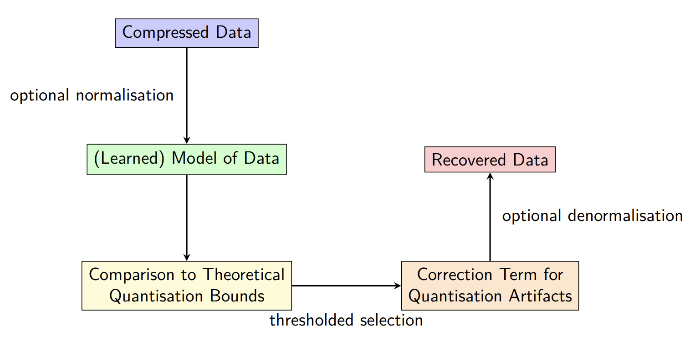

# 📓 Neural (De)compression for High Energy Physics

## 🚀 Project Introduction

In high-energy physics experiments such as those conducted at CERN's ATLAS project, the volume of data generated is immense, reaching up to 60 million MB per second. While lossless compression is already employed to manage this data, lossy compression—specifically of floating-point precision—offers more aggressive reductions, potentially decreasing file sizes by over 30%. However, this comes at the cost of irreversibly discarding information, raising the challenge of how to recover or approximate full-precision data for downstream analysis.

This project proposes a novel approach using deep probabilistic models to reconstruct high-precision floating-point data from aggressively compressed representations, a problem coined as **precision upsampling**. The goal is to explore and compare the capabilities of three classes of generative models: **autoencoders, diffusion models, and normalizing flows**.

Each model type offers distinct advantages:

* **Autoencoders** are well-studied in neural compression.
* **Diffusion models** are robust to noise and excel in reconstructing multi-scale structures.
* **Normalizing flows** offer exact likelihood estimation and invertible mappings that align well with the structured nature of physical data.

Deliverables include a literature review on neural precision upsampling methods, a working baseline model adapted to CERN's PHYSLITE floating-point compressed data, and a comparative study of advanced probabilistic models—including variational autoencoders, diffusion models, and normalizing flows. Evaluation metrics will also be tailored to the data and implemented. Final outputs will include reproducible code, performance benchmarks, a written technical report, and optionally a publication or integration into the ATLAS codebase.

---
## Key Results

The ATLAS presentation pdf file steps through key results found from data exploration. While this project has not yet conclusively found a candidate model to precision upsample, data exploration resulted in a detailed theoretical analysis and decomposition of data residuals caused by quantisation artifacts versus those that may be anomalous from the data itself. This has also been written up in the theoretical_analysis.md file.

Ongoing work can be seen in the .py files which have translated successful parts of the notebook explorations into python scripts for further testing, detailed further below.

## 📂 Notebook Overview

The notebooks are organized into three main stages:

* **01\_**\* → Data exploration and statistical analysis
* **02\_**\* → Probabilistic and neural modelling approaches
* **03\_**\* → Hybrid and advanced modelling strategies

Each stage builds towards the overarching goal: evaluating and improving methods for reconstructing precision in compressed high-energy physics data.

---

### 🔍 01 – Data Exploration & Statistical Analysis

Early notebooks focus on understanding the effects of **floating-point quantization** and setting up the evaluation pipeline for precision upsampling.

* **01\_data\_exploration.ipynb**
  General dataset exploration: histograms, descriptive statistics, outlier checks, and initial visualization of quantization artifacts.

* **01\_log\_quantisation\_peaks.ipynb**
  Investigates how precision truncation manifests in **log-space**, identifying systematic peaks or artifacts that may bias downstream analyses.

* **01\_2sampletest.ipynb**
  Applies two-sample hypothesis tests (e.g., KS test, t-test) to statistically compare distributions between original and quantized data.

* **01\_statistical\_comparisons.ipynb**
  Comprehensive statistical benchmarking using divergences (KL, JS), distances (Wasserstein, MMD), and classifier-based tests (AUC). Establishes the **metric suite** for later model evaluations.

* **01\_quantisation\_ablation.ipynb**
  Systematic ablation study: progressively removing mantissa bits and quantifying the degradation in data fidelity.

---

### 🤖 02 – Probabilistic & Neural Modelling

This stage explores machine learning models for directly modelling the data, to understand the expressivity of the models with regards to the data.

* **02\_modelling\_autoencoder.ipynb**
  Implements autoencoders and variational autoencoders as a baseline for reconstructing high-precision data from compressed inputs.

* **02\_modelling\_flowmatching.ipynb**
  Introduces **normalizing flows and flow matching** as generative approaches. These provide invertible mappings and exact likelihoods, aligning well with structured physics data.

*The flow matching model requires further training and was not used as a model for the following hybrid corrector approach, which was chosen such that the simplest approaches were used to work toward a simple baseline prior to extending to more complex model types*

---

### 🧩 03 – Hybrid & Advanced Modelling

Notebooks here combine statistical methods with neural models, exploring **hybrid pipelines** for better precision recovery.

* **03\_gaussian\_model\_triaging.ipynb**
  Fits Gaussian models to compressed distributions, analyzing residuals to identify cases where neural methods may be most needed.

* **03\_hybrid\_histogram\_model.ipynb**
  Proposes a hybrid reconstruction strategy: histogram-based density estimates for local precision, corrected with neural upsamplers.

* **03\_hybrid\_model.ipynb**
  Experimental notebook for developing mixed pipelines (statistical + deep learning) tailored to ATLAS-style floating-point compression.

---

## 🐍 Python Scripts

Ongoing work can be seen in the **`.py` files**, which translate successful parts of the notebook explorations into reusable Python modules. These scripts allow for **cleaner experimentation, easier testing, and integration into larger workflows** beyond the notebook stage.

### **datagen.py** – Data Generation & Loading

* Defines paths to both compressed and original ROOT data.
* Provides utilities for pairing files and generating datasets.
* Includes custom PyTorch `Dataset` classes for handling floating-point bitstreams and ROOT files.
* Forms the **data backbone** for all modelling experiments.

### **plotting.py** – Visualization Utilities

* Centralized functions for plots used across the project.
* Includes histograms, residual distributions, statistical comparison plots, and diagnostic contours.
* Ensures **consistent and reproducible visualizations** in both notebooks and scripts.

### **models.py** – Neural Architectures

* Houses model definitions: `ConvAutoencoder1D`, `Autoencoder1D`, `VAE1D`.
* Designed for training and evaluation of autoencoders and VAEs on compressed floating-point data.

### **inpainting.py** – Bitstream Inpainting with Transformers

* Implements a masked transformer for inpainting **truncated mantissa bits** in float32 representations.
* Provides utilities for float-to-binary conversions, constrained decoding (e.g., beam search), and baseline inference.
* Includes training and evaluation routines, making it a **self-contained module for bit-level reconstruction**.

### **hybrid\_model.py** – Hybrid Denoising Pipelines

* Combines neural networks (autoencoders) with **rule-based correction strategies**.
* Implements training, inference, and correction logic tailored for precision upsampling.
* Includes visualization and benchmarking utilities for hybrid methods.
* Represents a **bridge between statistical methods and deep learning approaches**.
